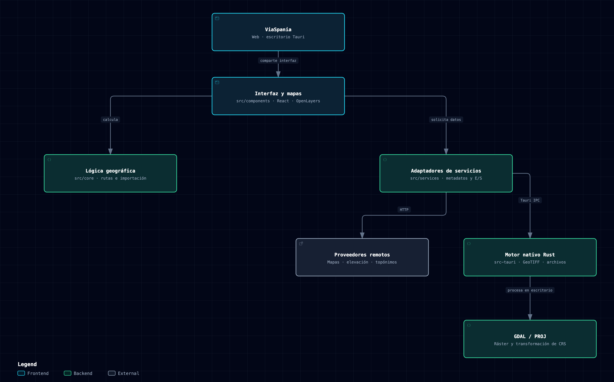

# ViaSpania

 [Español](#español) · [English](#english) · [Downloads / Descargas](https://github.com/Antonio-LopezGarcia/ViaSpania/releases) · [Issues](https://github.com/Antonio-LopezGarcia/ViaSpania/issues)

https://github.com/user-attachments/assets/de505214-9d69-454b-a74c-b7692f360993

## Español

ViaSpania es una aplicación de escritorio para analizar costes de desplazamiento sobre el terreno, comparar rutas y explorar la topografía, con cartografía y servicios de elevación integrados. Procesa los datos geográficos localmente mediante Tauri, Rust, GDAL/PROJ, React, OpenLayers y Three.js.

### Funciones

- Cuatro mapas sincronizados con visores ampliables, OpenStreetMap, PNOA, cartografía moderna e histórica del IGN/CNIG, imágenes Copernicus y capas XYZ/WMS/WMTS personalizadas.
- Descarga de modelos de elevación e importación local de GeoTIFF/COG, validación, reproyección y recorte. Se distinguen modelos del terreno y de superficie; los límites de procesamiento son configurables según la memoria disponible.
- Rutas de coste mínimo direccional, comparación de perfiles, conexiones multipunto, itinerarios multirruta ordenados y alternativas subóptimas espacialmente diferenciadas.
- Pasillos de coste mínimo, isócronas, cuencas visuales, curvas de nivel y perfiles de elevación.
- Perfiles de tiempo a pie, energía, movimiento pastoral, caravanas y vehículos de ruedas, con ayuda contextual sobre parámetros, unidades, supuestos y referencias científicas.
- Barreras, corredores preferentes, puentes/pasos y puntos de interés editables, incluidas visitas obligatorias.
- Proyectos JSON locales, importación de puntos CSV/GeoJSON, exportaciones vectoriales y ráster y compositor de informes PDF con atribución de fuentes.
- Terreno 3D interactivo con superposición de resultados y exportación de animaciones.

### Novedades de v0.2.2

- Ampliación de la traducción al inglés y español de interfaz, tutorial, ayuda contextual, informes, créditos y mensajes de estado.
- Revisión de la creación de proyectos vacíos, identificación del proyecto activo, controles de carga del modelo, validación del área de estudio y visores ampliables/separables.
- Búsqueda de lugares en línea mediante GeoNames e interpretación local de coordenadas WGS84 decimales (`latitud, longitud`).
- Edición más compacta de barreras y facilitadores, ayuda contextual, pasos obligatorios y conservación de sus metadatos en proyectos y exportaciones SIG.
- Selector de fondos común a los visores de cálculo, mejoras en los controles de comparación, superposiciones MDT y capas cartográficas externas en 3D e informes.
- Revisión del compositor de informes y del renderizado de mapas. Los mapas de cálculo se imprimen mediante el compositor; se han retirado la exportación PNG/PDF y la impresión directa de los visores de cálculo.
- Exportación 3D determinista de órbitas y seguimiento de rutas a AVI/MJPEG y GIF, fotogramas PNG, superposiciones de vídeo y perfiles de elevación. AVI sustituye a la captura MP4/WebM dependiente de cada plataforma; el vídeo de escritorio se escribe progresivamente en disco sin requerir FFmpeg.
- Nombres de exportación más portables, mejoras de cancelación y errores, ampliación de pruebas, actualización de créditos y financiación y comprobaciones de licencias de terceros durante el empaquetado.

El candidato 0.2.2 se validó con 414 pruebas TypeScript/React, 31 pruebas Rust y 13 pruebas del colector de cumplimiento, además del build web y los paquetes nativos. Consulte el [resumen del candidato](docs/RELEASE_0.2.2.md) y el [manual en español](docs/manual.md).

### Descargar e instalar

Descargue un instalador desde **Assets** en [GitHub Releases](https://github.com/Antonio-LopezGarcia/ViaSpania/releases). Los archivos automáticos «Source code» no son instaladores. Elija la arquitectura de su equipo:

| Sistema | Paquetes preparados para v0.2.2 | Arquitectura |
| --- | --- | --- |
| macOS | `.dmg` | Apple Silicon (`aarch64`, M1 y posteriores) |
| Windows | `-setup.exe` o `.msi` | Intel/AMD de 64 bits (`x64`) |
| Linux | `.AppImage`, `.deb`, `.rpm` | Intel/AMD (`amd64`/`x86_64`) o ARM64 (`arm64`/`aarch64`) |

No hay instalador para Mac Intel en v0.2.2. Los paquetes de escritorio incluyen GDAL/PROJ; el usuario no necesita Node.js, pnpm ni Rust. Sí se requieren los motores web del sistema: WebView2 en Windows y WebKitGTK/bibliotecas compatibles en Linux. Consulte la [información de Tauri sobre motores web](https://tauri.app/reference/webview-versions/).

#### macOS: primera apertura de la aplicación sin notarizar

El DMG de v0.2.2 no está firmado con un certificado Apple Developer ID ni notarizado por Apple. La firma local/ad hoc no equivale a notarización.

1. Abra el DMG y arrastre `ViaSpania.app` a **Aplicaciones**.
2. Intente abrirla. Ante un aviso de desarrollador no identificado o de notarización, vaya a **Ajustes del Sistema → Privacidad y seguridad → Abrir igualmente** y confirme. Consulte las [instrucciones de Apple](https://support.apple.com/es-es/102445).
3. Si la copia oficial verificada sigue bloqueada por la cuarentena, ciérrela y ejecute este comando en Terminal; después vuelva a abrirla:

   ```bash
   xattr -dr com.apple.quarantine "/Applications/ViaSpania.app"
   ```

Esto elimina la cuarentena únicamente de esa aplicación. Un aviso de aplicación «dañada» también puede indicar corrupción o modificación: descargue primero una copia oficial nueva y no omita una alerta de malware. Si los permisos o la política del equipo impiden abrirla, consulte al administrador; no desactive Gatekeeper globalmente.

#### Windows: instalador sin firma

Ejecute el archivo `-setup.exe` o `.msi` descargado y abra ViaSpania desde Inicio. Los instaladores de v0.2.2 no están firmados, por lo que SmartScreen puede mostrar **Windows protegió su PC**. Tras comprobar la procedencia, seleccione **Más información → Ejecutar de todas formas**, si aparece. Un aviso del Control de cuentas de usuario con «Editor desconocido» no verifica la identidad de la aplicación; autorice únicamente la instalación que acaba de iniciar. Consulte la [documentación de Microsoft sobre SmartScreen](https://learn.microsoft.com/en-us/windows/apps/package-and-deploy/smartscreen-reputation).

Si una política corporativa o Smart App Control bloquea la instalación sin ofrecer una excepción, consulte al administrador. No desactive Defender, SmartScreen ni el Control de cuentas de usuario. Windows utiliza firma de código y comprobaciones de reputación; la notarización de Apple no se aplica.

#### Linux: paquete local o AppImage

Elija un formato. Desde la carpeta de descargas, sustituya cada nombre de ejemplo por el del archivo descargado, con su arquitectura y versión:

```bash
# AppImage: conceder permiso de ejecución y abrir
chmod +x ./ViaSpania_0.2.2_amd64.AppImage
./ViaSpania_0.2.2_amd64.AppImage

# Debian / Ubuntu
sudo apt install ./ViaSpania_0.2.2_amd64.deb

# Distribuciones con DNF / RPM
sudo dnf install ./ViaSpania-0.2.2-1.x86_64.rpm
```

DEB/RPM añaden un lanzador de la aplicación. Los paquetes Linux no llevan firma de distribución; no existe la notarización de Apple. Si la política local rechaza paquetes sin firmar, use un método aprobado por el administrador en lugar de desactivar la verificación de firmas. La compatibilidad depende de arquitectura, glibc y WebKitGTK. Si AppImage indica que falta FUSE, utilice el DEB/RPM correspondiente o las instrucciones de FUSE de su distribución. El flujo de compilación usa Ubuntu 24.04 para AMD64 y Ubuntu 22.04 para ARM64; esto no garantiza compatibilidad con todas las distribuciones Linux.

### Primer análisis

1. Cree un proyecto y seleccione el área de estudio en el mapa de Navegación.
2. Descargue/procese un modelo de elevación o importe un GeoTIFF local. Revise la resolución y la memoria estimada antes de procesar.
3. Añada orígenes, destinos o multipuntos; configure el perfil de desplazamiento y las barreras o facilitadores necesarios.
4. Ejecute un análisis e inspeccione el mapa, las tablas y el perfil de elevación o la vista 3D.
5. Guarde el proyecto y exporte los productos necesarios o componga un informe PDF.

Consulte el [manual en español](docs/manual.md) para el procedimiento completo. ViaSpania 0.2.2 exporta proyectos JSON, GeoJSON, GeoPackage, GeoTIFF, informes PDF, fotogramas PNG, vídeo AVI y GIF animado. La disponibilidad depende del cálculo y del entorno de ejecución; conserve juntos el proyecto y sus archivos de elevación.

### Procesamiento local y limitaciones

Los cálculos se ejecutan localmente. Los mapas, las descargas de elevación y la búsqueda de topónimos requieren conexión y contactan con sus proveedores. GeoNames recibe el término buscado y utiliza una cuota compartida del proyecto; las coordenadas se interpretan localmente. Las capas personalizadas tienen sus propias condiciones de disponibilidad, atribución y acceso.

Los resultados dependen de la resolución, los supuestos del modelo, la conectividad y las restricciones configuradas. Las alternativas subóptimas no son las *k* rutas más cortas exactas; las visitas obligatorias no optimizan globalmente el orden de visita. Los costes en tiempo, energía y unidades relativas no son directamente comparables. La elevación no acredita caminos, permisos, cobertura del suelo ni condiciones seguras de paso. ViaSpania no sirve para navegación de emergencia.

### Soporte, autoría y licencia

Comunique problemas reproducibles en [Issues](https://github.com/Antonio-LopezGarcia/ViaSpania/issues), indicando versión/compilación, sistema y arquitectura, pasos, fuente de datos y error exacto. Retire los datos privados antes de adjuntar archivos. Contacto: [Antonio López García](mailto:antonio.lopez@ugr.es).

ViaSpania

Copyright © 2026 Antonio López García, Universidad de Granada

Este programa se distribuye bajo la licencia GPL-3.0-only. Consulte el texto íntegro y las condiciones separadas de los assets gráficos en [LICENSE](LICENSE). El software y los datos de terceros mantienen sus propias condiciones; consulte [THIRD_PARTY_NOTICES.md](THIRD_PARTY_NOTICES.md) y los créditos de la aplicación. Las fuentes incluyen © OpenStreetMap contributors (ODbL 1.0), IGN/CNIG y GeoNames. Conserve la atribución de cada fuente utilizada.

### Financiación

Este programa es resultado de la ayuda RYC2022-037730-I financiada por MICIU/AEI/10.13039/501100011033 y por ESF+.

[Reconocimiento de financiación y fuentes oficiales](docs/funding.md).

## Distribución GPL y fuentes correspondientes

La preparación de instaladores y sus fuentes se documenta en [RELEASE_COMPLIANCE.md](docs/RELEASE_COMPLIANCE.md). El expediente 0.2.2 inventaría 823 componentes y el control `pnpm compliance:check --strict` pasa con 0 revisiones pendientes para los hashes del candidato. Se cerraron y documentaron la autoría/autorización, los assets, las selecciones de licencia, el runtime nativo de macOS, las fuentes correspondientes y los datos/exportaciones. Estos cierres son específicos del material inventariado: cualquier cambio de dependencias, datos o binarios obliga a repetir las comprobaciones.

El borrador ofrece el instalador junto con un paquete de fuentes verificable dividido en partes, su manifiesto SHA-256 y la inspección de la aplicación. Las reconstrucciones de PROJ, Apache Arrow, GDAL y SFCGAL aportan evidencia adicional, pero no se presentan como reproducibilidad bit a bit. Consulte [CORRESPONDING_SOURCE_REVIEW.md](docs/CORRESPONDING_SOURCE_REVIEW.md), [DATA_LICENSE_REVIEW.md](docs/DATA_LICENSE_REVIEW.md) y [NATIVE_LICENSE_REVIEW.md](docs/NATIVE_LICENSE_REVIEW.md).

### Autoría y autorización institucional

La autoría de Antonio López García, la titularidad institucional declarada de la Universidad de Granada y la autorización comunicada para publicar en el GitHub personal se documentan en [docs/CODE_OWNERSHIP.md](docs/CODE_OWNERSHIP.md). Se mantiene el aviso de copyright conjunto solicitado por la UGR y GPL-3.0-only para el código propio. Las licencias y derechos de terceros se conservan separadamente.

El repositorio principal se trasladó de la cuenta histórica `traxtiber` a [`Antonio-LopezGarcia/ViaSpania`](https://github.com/Antonio-LopezGarcia/ViaSpania). Este cambio de propietario en GitHub no altera la autoría ni la titularidad institucional documentadas, y los enlaces de clonación, incidencias y releases apuntan ya a la ubicación actual.

El logotipo propio conserva copyright separado, con permiso para redistribuirlo sin modificar junto con ViaSpania, también en copias comerciales y versiones modificadas claramente identificadas. Véanse [las condiciones de assets](docs/ASSETS.md). Los logotipos MICIU/UE/AEI se conservan como reconocimiento de la financiación original.

## English

ViaSpania is a desktop application for terrain-based least-cost analysis, route comparison and topographic exploration, with integrated cartography and elevation services. It processes geographic data locally using Tauri, Rust, GDAL/PROJ, React, OpenLayers and Three.js.

### Features

- Four synchronised maps with expandable viewers, OpenStreetMap, PNOA, IGN/CNIG modern and historical cartography, Copernicus imagery and custom XYZ/WMS/WMTS layers.
- Elevation-model download and local GeoTIFF/COG import, validation, reprojection and clipping. Terrain and surface models are distinguished; processing limits are configurable according to available memory.
- Directional least-cost routes, profile comparison, multipoint connections, ordered multi-route itineraries and spatially distinct sub-optimal alternatives.
- Least-cost corridors, isochrones, viewsheds, contour lines and elevation profiles.
- Walking-time, energy, pastoral, caravan and wheeled cost profiles, with contextual documentation of parameters, units, assumptions and scientific references.
- Editable barriers, preferred corridors, bridges/crossings and points of interest, including mandatory visits.
- Local JSON projects, CSV/GeoJSON point import, vector and raster exports, and a PDF report composer with source attribution.
- Interactive 3D terrain with analytical overlays and animation exports.

### What's new in v0.2.2

- Expanded English and Spanish localisation across the interface, tutorial, contextual help, reports, credits and status messages.
- Revised empty-project creation, active-project identification, model-loading controls, study-area validation and expandable/detachable viewers.
- Online place search through GeoNames, plus local parsing of WGS84 decimal coordinates (`latitude, longitude`).
- More compact barrier/facilitator editing, contextual help, mandatory crossings and preservation of crossing metadata in project and GIS exports.
- Shared background selection across calculation viewers, improved comparison controls, DTM overlays and external cartographic layers in 3D and reports.
- Revised report composition and map rendering. Calculation maps are printed through the report composer; direct PNG/PDF export and printing have been removed from calculation viewers.
- Deterministic 3D orbit and route-following exports to AVI/MJPEG and GIF, PNG frame export, video overlays and elevation profiles. AVI replaces the platform-dependent MP4/WebM capture path; desktop video is written progressively to disk without requiring FFmpeg.
- More portable export filenames, improved cancellation/error handling, expanded tests, updated credits and funding acknowledgement, and third-party licence checks during packaging.

The 0.2.2 candidate was validated with 414 TypeScript/React tests, 31 Rust tests and 13 compliance-collector tests, together with the web build and native packages. See the [candidate summary](docs/RELEASE_0.2.2.md) and [English manual](docs/manual.en.md).

### Download and install

Download an installer from the **Assets** section of [GitHub Releases](https://github.com/Antonio-LopezGarcia/ViaSpania/releases). The automatically generated “Source code” archives are not installers. Choose the architecture of your computer:

| System | Packages prepared for v0.2.2 | Architecture |
| --- | --- | --- |
| macOS | `.dmg` | Apple Silicon (`aarch64`, M1 and later) |
| Windows | `-setup.exe` or `.msi` | Intel/AMD 64-bit (`x64`) |
| Linux | `.AppImage`, `.deb`, `.rpm` | Intel/AMD (`amd64`/`x86_64`) or ARM64 (`arm64`/`aarch64`) |

There is no Intel Mac installer for v0.2.2. Desktop packages include GDAL/PROJ; end users do not need Node.js, pnpm or Rust. System web runtimes are still required: WebView2 on Windows and compatible WebKitGTK/system libraries on Linux. See [Tauri runtime information](https://tauri.app/reference/webview-versions/).

#### macOS: first launch of the unnotarized application

The v0.2.2 DMG is not signed with an Apple Developer ID certificate or notarized by Apple. Local/ad hoc signing is not notarization.

1. Open the DMG and drag `ViaSpania.app` into **Applications**.
2. Try opening it. For an unidentified-developer/notarization warning, open **System Settings → Privacy & Security → Open Anyway**, then confirm. See [Apple's instructions](https://support.apple.com/en-us/102445).
3. If the verified official copy remains blocked by quarantine, close it and run this command in Terminal, then reopen it:

   ```bash
   xattr -dr com.apple.quarantine "/Applications/ViaSpania.app"
   ```

This removes quarantine only from that application. A “damaged” message can also mean corruption or modification: download a fresh official copy first, and do not bypass a malware alert. If permissions or device policy prevent opening the app, contact the administrator; do not disable Gatekeeper globally.

#### Windows: unsigned installer

Run either the downloaded `-setup.exe` or `.msi`, then open ViaSpania from the Start menu. The v0.2.2 installers are unsigned, so SmartScreen may display **Windows protected your PC**. After checking the download's origin, choose **More info → Run anyway** if offered. An “Unknown publisher” UAC prompt does not verify the application's identity; approve only the installation you intentionally started. See [Microsoft's SmartScreen documentation](https://learn.microsoft.com/en-us/windows/apps/package-and-deploy/smartscreen-reputation).

If an organisational policy or Smart App Control blocks installation without an override, contact the administrator. Do not turn off Defender, SmartScreen or UAC. Windows uses code signing and reputation checks; Apple notarization does not apply.

#### Linux: local package or AppImage

Choose one format. From the download directory, replace each example filename with the exact file you downloaded, matching your architecture and version:

```bash
# AppImage: grant execution permission, then launch
chmod +x ./ViaSpania_0.2.2_amd64.AppImage
./ViaSpania_0.2.2_amd64.AppImage

# Debian / Ubuntu
sudo apt install ./ViaSpania_0.2.2_amd64.deb

# Distributions using DNF / RPM
sudo dnf install ./ViaSpania-0.2.2-1.x86_64.rpm
```

DEB/RPM installations add an application launcher. Linux packages do not carry a distribution signature; there is no Apple-style notarization. If local policy rejects an unsigned package, use an administrator-approved installation method rather than disabling signature checks. Compatibility depends on architecture, glibc and WebKitGTK. If AppImage reports missing FUSE, use the matching DEB/RPM or your distribution's FUSE instructions. The build workflow uses Ubuntu 24.04 for AMD64 and Ubuntu 22.04 for ARM64; this is not a guarantee of compatibility with every Linux distribution.

### First analysis

1. Create a project and choose a study area on the Navigation map.
2. Download/process an elevation model or import a local GeoTIFF. Check resolution and estimated memory before processing.
3. Add origins, destinations or multipoints; configure the travel profile and any barriers or facilitators.
4. Run an analysis and inspect its map, tables and elevation profile or 3D view.
5. Save the project and export the required products or compose a PDF report.

See the [English manual](docs/manual.en.md) for the full workflow. ViaSpania 0.2.2 exports project JSON, GeoJSON, GeoPackage, GeoTIFF, PDF reports, PNG frames, AVI video and animated GIF. Availability depends on the calculation and runtime; keep the project and its elevation files together.

### Local processing and limitations

Calculations run locally. Map tiles, elevation downloads and place-name searches require network access and contact their respective providers. GeoNames searches send the entered term and use a shared project quota; coordinate input is parsed locally. Custom layers have their own availability, attribution and access conditions.

Results depend on elevation resolution, model assumptions, connectivity and configured constraints. Sub-optimal alternatives are not exact *k*-shortest paths; mandatory visits do not globally optimise visit order. Costs expressed in time, energy and relative units cannot be compared directly. Elevation does not establish paths, legal access, land cover or safe passage. ViaSpania is not an emergency-navigation system.

### Support, authorship and licence

Report reproducible problems in [Issues](https://github.com/Antonio-LopezGarcia/ViaSpania/issues), including version/build, OS and architecture, steps, data source and the exact error. Remove private project data before attaching files. Contact: [Antonio López García](mailto:antonio.lopez@ugr.es).

ViaSpania

Copyright © 2026 Antonio López García, Universidad de Granada

Este programa se distribuye bajo la licencia GPL-3.0-only. See [LICENSE](LICENSE) for the full licence and the separate terms for graphical assets. Third-party software and data retain their own terms; see [THIRD_PARTY_NOTICES.md](THIRD_PARTY_NOTICES.md) and in-app credits. Data credits include © OpenStreetMap contributors (ODbL 1.0), IGN/CNIG and GeoNames. Preserve the attribution of every source used.

### Funding

This application is a result of the grant RYC2022-037730-I funded by MICIU/AEI/10.13039/501100011033 and by ESF+.

[Funding acknowledgement and official sources](docs/funding.md).

## GPL distribution and corresponding source

Installer and source preparation is documented in [RELEASE_COMPLIANCE.md](docs/RELEASE_COMPLIANCE.md). The 0.2.2 record inventories 823 components, and `pnpm compliance:check --strict` passes with 0 pending reviews for the candidate hashes. Authorship/permission, assets, licence selections, the macOS native runtime, corresponding source, and data/exports have been reviewed and closed for that exact inventory. Dependency, data or binary changes require the checks to be repeated.

The draft provides the installer together with a split, verifiable source package, its SHA-256 manifest and the application inspection record. Partial rebuilds of PROJ, Apache Arrow, GDAL and SFCGAL provide additional evidence but are not claimed as bit-for-bit reproducibility. See [CORRESPONDING_SOURCE_REVIEW.md](docs/CORRESPONDING_SOURCE_REVIEW.md), [DATA_LICENSE_REVIEW.md](docs/DATA_LICENSE_REVIEW.md) and [NATIVE_LICENSE_REVIEW.md](docs/NATIVE_LICENSE_REVIEW.md).

### Authorship, institutional ownership and repository move

[CODE_OWNERSHIP.md](docs/CODE_OWNERSHIP.md) records Antonio López García's authorship, the declared institutional ownership of the University of Granada, and the communicated permission to publish in the author's personal GitHub repository. The requested joint copyright notice and GPL-3.0-only licensing for original code are retained; third-party rights remain separate.

The primary repository moved from the historical `traxtiber` account to [`Antonio-LopezGarcia/ViaSpania`](https://github.com/Antonio-LopezGarcia/ViaSpania). This GitHub ownership change does not alter the documented authorship or institutional ownership. Clone, issue and release links now use the current location.

---

## Arquitectura de ViaSpania


