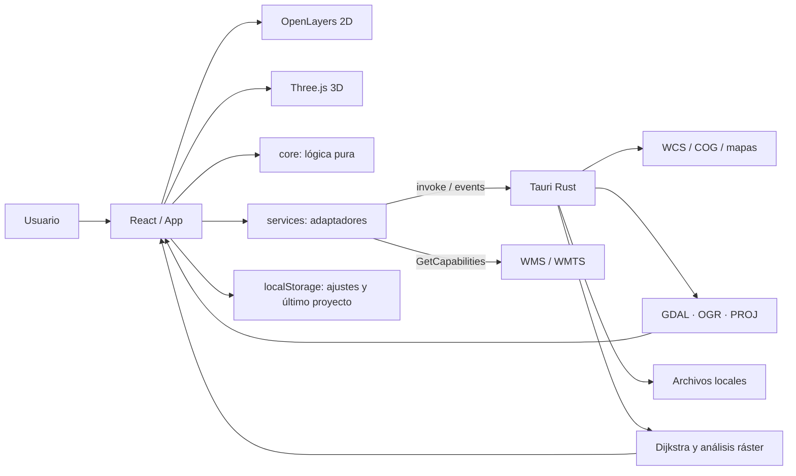
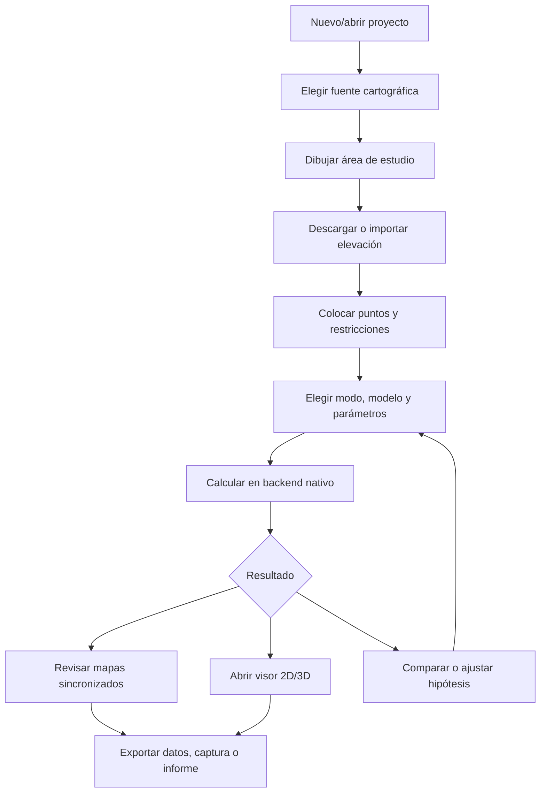

# Traspaso de ViaSpania a Aqua

> Análisis técnico y visual del repositorio ViaSpania, preparado el 3 de septiembre de 2026. Este documento describe cómo reproducir su lenguaje de producto en una aplicación independiente llamada **Aqua** sin convertir Aqua en una copia acoplada a ViaSpania.

## Resumen ejecutivo

ViaSpania es una aplicación de escritorio **local-first** para análisis territorial. Su interfaz es React 19 + TypeScript estricto, OpenLayers dibuja cartografía 2D, Three.js el terreno 3D y Tauri 2 conecta la UI con un backend Rust que descarga y procesa GeoTIFF mediante GDAL/PROJ y ejecuta cálculos de coste sobre ráster. Vite genera dos entradas: la aplicación y una web pública independiente ([`package.json:21-40`](package.json#L21), [`vite.config.ts:14-25`](vite.config.ts#L14)).

Su identidad no depende de imágenes complejas: nace de una interfaz densa de escritorio, fondos verde-negro, superficies estratificadas, bordes verdes apagados, acento lima `#d8ff55`, controles compactos, mapas sincronizados y visualizaciones científicas de color intenso. Esto la hace reproducible mediante tokens y componentes, pero hoy esos tokens no están formalizados y buena parte de la orquestación vive en un único `App.tsx` de más de 450 líneas.

Para Aqua conviene reutilizar **ideas y módulos genéricos**, no la marca ni la configuración territorial española. La base recomendada es un monorepo pequeño o una aplicación con capas `ui / domain / application / infrastructure`, contratos tipados para capacidades nativas y un estado por dominios. Los adaptadores de OpenLayers, Tauri, importación/exportación y varias funciones puras pueden inspirar implementaciones independientes. Los modelos científicos, endpoints IGN, atribuciones, prefijos de almacenamiento, textos, iconos y marca VS deben evaluarse o reconstruirse expresamente.

## 1. Arquitectura general

### 1.1 Plataforma, lenguaje y compilación

| Capa | Tecnología | Papel | Referencia |
|---|---|---|---|
| UI | React 19.1 / React DOM | Aplicación declarativa, estado local y overlays | [`package.json:26-27`](package.json#L26), [`src/main.tsx:1-5`](src/main.tsx#L1) |
| Lenguaje | TypeScript 5.9, modo `strict`, ES2022 | UI, dominio, adaptadores y pruebas | [`tsconfig.app.json:2-8`](tsconfig.app.json#L2) |
| Build web | Vite 7 + plugin React | Desarrollo, bundle y dos entradas HTML | [`package.json:7-19`](package.json#L7), [`vite.config.ts:14-25`](vite.config.ts#L14) |
| Escritorio | Tauri 2 | Ventana nativa, IPC, diálogos, empaquetado | [`src-tauri/tauri.conf.json:1-31`](src-tauri/tauri.conf.json#L1) |
| Backend | Rust 2021 + Tokio | Red, archivos, procesos GDAL y cálculo intensivo | [`src-tauri/Cargo.toml:1-25`](src-tauri/Cargo.toml#L1) |
| Mapas 2D | OpenLayers 10.6 | XYZ, WMS, WMTS, vectores, sincronización de vista | [`package.json:25`](package.json#L25), [`src/services/externalMapLayers.ts:1-12`](src/services/externalMapLayers.ts#L1) |
| 3D | Three.js 0.185 | Malla de elevación y overlays 3D | [`package.json:28`](package.json#L28), [`docs/architecture.md:15-19`](docs/architecture.md#L15) |
| PDF | jsPDF 4.2 | Informes y capturas cartográficas | [`package.json:24`](package.json#L24), [`src/App.tsx:12-14`](src/App.tsx#L12) |
| Pruebas | Vitest, Testing Library, jsdom | Lógica pura y componentes | [`package.json:30-40`](package.json#L30) |
| Geoespacial nativo | GDAL/OGR/PROJ externos empaquetados | Validación, reproyección, recorte, COG y lectura | [`docs/native-backend.md:3-16`](docs/native-backend.md#L3) |

`pnpm build` ejecuta primero `tsc -b` y después Vite; `pnpm desktop:build` prepara las herramientas geoespaciales y construye Tauri ([`package.json:8-19`](package.json#L8)). Vite inyecta versión, commit, estado dirty, fecha y plataforma como constantes de compilación ([`vite.config.ts:6-23`](vite.config.ts#L6)).

La ventana de escritorio parte de 1440 × 920 px y exige al menos 900 × 650 px. La CSP permite imágenes y conexiones HTTP/HTTPS, además de IPC, pero mantiene scripts en `self` ([`src-tauri/tauri.conf.json:12-25`](src-tauri/tauri.conf.json#L12)).

### 1.2 Organización de carpetas

```text
ViaSpania/
├── src/
│   ├── components/       UI React, mapas y visores
│   ├── core/             dominio TypeScript puro y utilidades
│   ├── services/         IPC nativo, OGC, exportación e informes
│   ├── website/          web pública independiente
│   ├── App.tsx           composición y estado global de facto
│   ├── main.tsx          entrada de la aplicación
│   ├── types.ts          contratos de dominio compartidos
│   └── *.css             estilos globales y por función
├── src-tauri/
│   ├── src/lib.rs        comandos, geoprocesamiento y algoritmos
│   ├── tauri.conf.json   ventana, CSP, bundle e iconos
│   └── resources/        bundle geoespacial
├── docs/                 arquitectura, ADR, manuales e investigación
├── scripts/              preparación GDAL/PROJ por plataforma
├── public/fixtures/      previsto para fixtures deterministas
├── index.html            shell de la aplicación
└── web/index.html        shell del sitio público
```

La intención arquitectónica está documentada: React/TypeScript conserva interacción, estado de mapa independiente del proveedor, imports, proyecto JSON y presentación; Rust debe poseer cancelación, red WCS, GDAL/PROJ y grafos grandes ([`docs/architecture.md:1-5`](docs/architecture.md#L1)).

### 1.3 Entradas, navegación y estado

Hay dos entradas de Vite:

- `index.html` → `src/main.tsx` → `App`, envuelto en `StrictMode` y `LocalizationBoundary` ([`index.html:1-10`](index.html#L1), [`src/main.tsx:1-5`](src/main.tsx#L1)).
- `web/index.html` → `src/website/main.tsx` → `Website` ([`web/index.html:1-11`](web/index.html#L1), [`src/website/main.tsx:1-6`](src/website/main.tsx#L1)).

No existe React Router. La aplicación es una sola pantalla de trabajo y la navegación funcional se modela mediante `tab` (`ruta`, `comparar`, `multipunto`, `multirruta`, `isocronas`, `pasillos`, `topografia`) ([`src/App.tsx:70-75`](src/App.tsx#L70)). La web pública navega mediante anclas `#programa`, `#funciones`, etc. y solo usa estado local para menú, idioma y perfil abierto ([`src/website/Website.tsx:56-65`](src/website/Website.tsx#L56)).

El estado principal usa muchos `useState` en `App`: proyecto, puntos, mapa, fuente de elevación, ráster, barreras, facilitadores, rutas, matrices, resultados, visores e informes ([`src/App.tsx:70-109`](src/App.tsx#L70)). No hay Redux, Zustand ni Context de dominio. La comunicación lateral incluye props, callbacks, portales y eventos globales `CustomEvent` con nombres `viaspania-*` ([`src/App.tsx:88-90`](src/App.tsx#L88), [`src/App.tsx:145`](src/App.tsx#L145)). Esto funciona, pero es el principal acoplamiento que Aqua no debería reproducir.

### 1.4 Flujo de datos



El adaptador `src/services/native.ts` expone una API TypeScript clara sobre `invoke`: estado nativo, capacidades, descarga/cancelación WCS, procesamiento ráster y COG, inspección, previews, rutas, isócronas, pasillos, muestreo, malla, curvas y visibilidad ([`src/services/native.ts:18-29`](src/services/native.ts#L18), [`src/services/native.ts:74-82`](src/services/native.ts#L74)). La caché nativa conserva una sola superficie preparada y la invalida cuando cambian ráster o barreras, no al cambiar extremos o modelo ([`docs/architecture.md:3-5`](docs/architecture.md#L3)).

### 1.5 Persistencia, almacenamiento y autenticación

- **Ajustes**: `localStorage`, clave `viaspania.settings.v1`; incluye idioma, tutorial, fuentes, mapas, límite de celdas, sonido, defaults de informe y capas externas ([`src/core/appSettings.ts:9-38`](src/core/appSettings.ts#L9), [`src/core/appSettings.ts:43-47`](src/core/appSettings.ts#L43)).
- **Último proyecto**: JSON completo en `localStorage`, clave `viaspania.last-saved-project.v1` ([`src/core/appSettings.ts:45-47`](src/core/appSettings.ts#L45)).
- **Proyecto durable**: JSON elegido con diálogo nativo. Se serializan puntos, resultados, parámetros, barreras, facilitadores, extensión, fuente y paleta; el ráster se vuelve a cargar al abrir ([`src/App.tsx:137-141`](src/App.tsx#L137)).
- **Rásteres y exportaciones**: archivos locales elegidos por el usuario o escritos en el directorio de datos de `es.viaspania.desktop` ([`docs/native-backend.md:8-13`](docs/native-backend.md#L8)).
- **Base de datos**: la arquitectura menciona SQLite/GeoPackage como frontera nativa, pero el estado actual se apoya principalmente en JSON y archivos; GeoPackage se usa como formato de exportación ([`docs/architecture.md:3`](docs/architecture.md#L3), [`src/core/resultExports.ts:5-21`](src/core/resultExports.ts#L5)).
- **Autenticación**: no existe login, cuenta, sesión remota ni telemetría. Los datos permanecen locales; las llamadas remotas se limitan a teselas y solicitudes explícitas ([`docs/architecture.md:10-11`](docs/architecture.md#L10)).

### 1.6 Servicios externos y seguridad

Fuentes incluidas: OpenStreetMap; mapas topográficos, PNOA e históricos de IGN/CNIG; Copernicus VHR; MDT/MDS de IGN/IDEE; Copernicus DEM GLO-30 ([`src/core/mapSources.ts:5-16`](src/core/mapSources.ts#L5), [`src/core/elevationSources.ts:18-23`](src/core/elevationSources.ts#L18)). Los endpoints principales aparecen en [`src/services/ogc.ts:1-6`](src/services/ogc.ts#L1).

El backend restringe descargas a una lista de hosts IGN/IDEE/Copernicus y limita cada descarga a 1,5 GB; el cálculo de rutas admite como máximo 5 millones de celdas ([`src-tauri/src/lib.rs:21-30`](src-tauri/src/lib.rs#L21)). El usuario también puede registrar XYZ, WMS o WMTS externos; se normalizan protocolos y URL y se conservan atribuciones ([`src/core/externalMapLayers.ts:1-13`](src/core/externalMapLayers.ts#L1), [`src/services/externalMapLayers.ts:7-12`](src/services/externalMapLayers.ts#L7)). La inspección de capabilities WMS/WMTS se hace con `fetch` en web ([`src/services/externalCapabilities.ts:12-27`](src/services/externalCapabilities.ts#L12)).

## 2. Sistema visual

### 2.1 Carácter

El producto combina “instrumento científico” y “cartografía nocturna”: alta densidad, paneles rectangulares, tipografía pequeña, controles oscuros, datos monoespaciados y un único acento energético. La web pública amplía la misma voz con grandes titulares, terreno abstracto animado y bloques editoriales.

### 2.2 Paleta exacta

No existe un fichero de tokens. Los valores se repiten en CSS. La tabla consolida los colores que Aqua debería convertir en variables semánticas:

| Token propuesto | Valor | Uso en ViaSpania |
|---|---:|---|
| `--aqua-bg-deep` | `#060908` / `#07100d` / `#08100d` | fondo de mapa, overlays y web |
| `--aqua-surface-1` | `#101713` | panel/modal principal |
| `--aqua-surface-2` | `#111815` / `#111916` | tarjetas y contenido |
| `--aqua-surface-3` | `#151e1a` / `#17201c` | inputs, secciones elevadas |
| `--aqua-border` | `#33413a`, `#35433c`, `#46534c` | separadores y bordes |
| `--aqua-text` | `#e7eee9`, `#dce7df`, `#fff` | texto principal |
| `--aqua-text-muted` | `#96a39b`, `#9ca9a1`, `#aebbb3` | metadatos y ayudas |
| `--aqua-accent` | `#d8ff55` | selección, CTA, títulos, progreso |
| `--aqua-info` | `#00f0ff`, `#59d2ff`, `#2fe5ff` | rutas, inicio, cruces |
| `--aqua-danger` | `#ff5656`, `#ff796f`, `#ff8a80` | error/final/alerta |
| `--aqua-warning` | `#f2b84b`, `#f4cf66` | proceso y advertencia |
| `--aqua-violet` | `#c56cff` | corredores preferentes |
| `--aqua-poi` | `#ffb347` | puntos de interés |

Ejemplos verificables: controles cartográficos y selección activa en [`src/map-tools.css:21-30`](src/map-tools.css#L21); modal y mensajes de importación en [`src/raster-import.css:1`](src/raster-import.css#L1); estados de cálculo en [`src/ui-additions.css:15-17`](src/ui-additions.css#L15); web y variable `--lime` en [`src/website/website.css:1`](src/website/website.css#L1). Los colores funcionales de overlays también se dibujan en canvas desde [`src/App.tsx:61-63`](src/App.tsx#L61).

### 2.3 Tipografía y jerarquía

- Familia UI/web: `Inter, ui-sans-serif, system-ui, -apple-system, BlinkMacSystemFont, "Segoe UI", sans-serif`. Inter no se descarga ni se empaqueta, por lo que normalmente cae en la fuente del sistema ([`src/website/website.css:1`](src/website/website.css#L1)).
- Datos/coordenadas: `ui-monospace` o `monospace` ([`src/map-tools.css:97`](src/map-tools.css#L97), [`src/calculation-help.css:4`](src/calculation-help.css#L4)).
- Aplicación: escala compacta de `9`, `10`, `11`, `12`, `13`, `14` y `17` px; peso 600–900 para acciones, cifras y títulos. Ejemplos en [`src/facilitators.css:1`](src/facilitators.css#L1) y [`src/calculation-help.css:3-4`](src/calculation-help.css#L3).
- Web: titulares editoriales mucho mayores, `clamp(...)`, con énfasis en cursiva y etiquetas en mayúsculas/letter-spacing; todo está definido en la hoja minificada [`src/website/website.css:1`](src/website/website.css#L1).

Para Aqua, fijar explícitamente la decisión: o empaquetar Inter con licencia/woff2, o declarar oficialmente la pila del sistema. Evitar que el aspecto dependa accidentalmente de que Inter esté instalada.

### 2.4 Espaciado, bordes, radios y sombras

El sistema implícito usa una rejilla de aproximadamente 4 px:

- Gaps frecuentes: `4`, `5`, `6`, `7`, `8`, `9`, `10`, `12`, `14`, `16`, `18`, `20`, `24` px.
- Padding de controles: 5–9 px; tarjetas 8–16 px; overlays 14–24 px.
- Bordes: 1 px sólidos; zonas de drop o placeholders, 1–2 px discontinuos.
- Radios: 5–9 px en controles/tarjetas, 10–14 px en ventanas, `50%`/`999px` en iconos y progreso.
- Sombras de modal: `0 24px 70px #000` o `#000c`; flotantes: `0 4px 18px #0008` y `0 6px 24px #0008`.
- Backdrops: negro-verde con alfa (`#020604cc`/`#020604d9`) y blur de 3–4 px.

Referencias: [`src/general-settings.css:1`](src/general-settings.css#L1), [`src/calculation-help.css:1-4`](src/calculation-help.css#L1), [`src/ui-additions.css:5`](src/ui-additions.css#L5).

### 2.5 Iconos, marca y recursos

- La marca web es un monograma tipográfico **VS** dentro de un bloque, junto a “ViaSpania”; no es un logo importado ([`src/website/Website.tsx:57`](src/website/Website.tsx#L57)).
- La marca de agua de exportación vuelve a dibujar `VS` y “ViaSpania” en canvas ([`src/core/exportWatermark.ts:3-30`](src/core/exportWatermark.ts#L3)).
- Los iconos de herramientas son SVG inline simples; por ejemplo el ojo del visor ([`src/components/ViewerIcon.tsx:1`](src/components/ViewerIcon.tsx#L1)) y los iconos de mano/herramienta ([`src/App.tsx:441-453`](src/App.tsx#L441)).
- La selección cartográfica genera un SVG de mira desde código ([`src/components/selectionMarkerStyle.ts:3`](src/components/selectionMarkerStyle.ts#L3)).
- El fondo web es un canvas/visual generado por `TerrainBackdrop`, no una fotografía ([`src/website/TerrainBackdrop.tsx:1-41`](src/website/TerrainBackdrop.tsx#L1)).
- Los iconos nativos existen en `src-tauri/icons/` y Tauri empaqueta las variantes indicadas en [`src-tauri/tauri.conf.json:27-31`](src-tauri/tauri.conf.json#L27).

Aqua debe crear su propio monograma, iconos de aplicación y marca de agua. Copiar “VS”, el nombre o los iconos empaquetados impediría que fuese realmente independiente.

### 2.6 Responsive y breakpoints

La aplicación está diseñada primero para escritorio; la ventana nativa mínima de 900 px lo confirma. Los breakpoints encontrados son:

| Ancho | Cambio |
|---:|---|
| `1150px` | compositor de informe pasa de cuatro a dos columnas ([`src/report-composer.css:2`](src/report-composer.css#L2)) |
| `900px` | panel de animación 3D ocupa casi todo el ancho ([`src/terrain-3d.css:4`](src/terrain-3d.css#L4)) |
| `850px` | exportación pasa 4→2 columnas; compositor oculta propiedades ([`src/result-export.css:1`](src/result-export.css#L1), [`src/report-composer.css:1`](src/report-composer.css#L1)) |
| `800px` | comparación split horizontal pasa a vertical; sidebar baja ([`src/comparison-viewer.css:1`](src/comparison-viewer.css#L1)) |
| `700px` | settings, ayuda, tutorial e informe se apilan ([`src/general-settings.css:1`](src/general-settings.css#L1), [`src/calculation-help.css:5`](src/calculation-help.css#L5), [`src/tutorial.css:19`](src/tutorial.css#L19)) |
| `650/600px` | opciones e información de ráster pasan a una columna ([`src/report-export.css:1`](src/report-export.css#L1), [`src/raster-import.css:1`](src/raster-import.css#L1)) |

La web pública contiene además su propia adaptación de menú y grids en [`src/website/website.css:1`](src/website/website.css#L1). Aqua debería decidir si seguirá siendo desktop-only; si necesita móvil real, no basta con heredar estos ajustes de modal.

### 2.7 Movimiento

Las animaciones UI son discretas: transición de anchura de barras (`.2s`/`.25s`), pulso de estado a `.8s`, barra indeterminada a `1.15s`, scroll suave en la web y efectos del fondo topográfico ([`src/ui-additions.css:4`](src/ui-additions.css#L4), [`src/ui-additions.css:15-17`](src/ui-additions.css#L15), [`src/website/website.css:1`](src/website/website.css#L1)). El 3D ofrece animaciones funcionales de órbita y recorrido y exporta MP4/WebM/GIF localmente ([`docs/architecture.md:17-19`](docs/architecture.md#L17)).

## 3. Interfaz y componentes

### 3.1 Pantallas y rutas

**Aplicación (`/`, sin rutas internas):**

1. Workspace principal con cabecera, cuatro paneles (navegación, selección/ortofoto, modelo digital, histórico) y panel lateral de opciones ([`src/App.tsx:203-222`](src/App.tsx#L203), [`src/App.tsx:223-314`](src/App.tsx#L223)).
2. Modos laterales: Ruta simple, Ruta comparativa, Multipunto, Multirruta, Pasillo, Isócronas, Visibilidad y Curvas de nivel ([`src/App.tsx:314-316`](src/App.tsx#L314)).
3. Overlays a pantalla completa: terreno 3D, comparación, ruta/secuencia, isócronas, pasillos y análisis de superficie.
4. Diálogos: nuevo proyecto, importar ráster, ajustes, ayuda, ayuda de cálculo, créditos, exportar resultados e informes.
5. Tutorial guiado superpuesto.

**Web pública (`/web/`, anclas):** inicio, programa, funciones, investigación, perfiles, código/licencias, autor, descargas y contacto ([`src/website/Website.tsx:65-77`](src/website/Website.tsx#L65)).

### 3.2 Inventario de componentes reutilizables

| Componente | Archivo | Responsabilidad | Valor para Aqua |
|---|---|---|---|
| `MapPanel` | [`src/components/MapPanel.tsx`](src/components/MapPanel.tsx) | OpenLayers, capas base/externas, dibujo, puntos, elementos y vista compartida | Alto como patrón; desacoplar fuentes españolas |
| `MdtMapPanel` | [`src/components/MdtMapPanel.tsx`](src/components/MdtMapPanel.tsx) | Preview ráster sincronizado, cursor y overlays | Alto si Aqua usa ráster |
| `Terrain3D` | [`src/components/Terrain3D.tsx`](src/components/Terrain3D.tsx) | Entrada al visor Three.js | Medio/alto; extraer contratos |
| `ComparisonViewer` | [`src/components/ComparisonViewer.tsx`](src/components/ComparisonViewer.tsx) | Comparación split/overlay de capas y resultados | Alto como patrón visual |
| `SurfaceAnalysisViewer` | [`src/components/SurfaceAnalysisViewer.tsx`](src/components/SurfaceAnalysisViewer.tsx) | Shell genérico de visor de superficies | Alto |
| `IsochroneViewer` / `LcpCorridorViewer` | [`src/components/IsochroneViewer.tsx`](src/components/IsochroneViewer.tsx), [`src/components/LcpCorridorViewer.tsx`](src/components/LcpCorridorViewer.tsx) | Especializaciones de superficie | Reinterpretar según dominio Aqua |
| `ElevationProfileOverlay` | [`src/components/ElevationProfileOverlay.tsx`](src/components/ElevationProfileOverlay.tsx) | Perfil SVG de distancia/cota | Alto si existe perfil longitudinal |
| `PointListEditor` | [`src/components/PointListEditor.tsx`](src/components/PointListEditor.tsx) | Selección, renombrado y borrado | Alto |
| `FacilitatorEditor` | [`src/components/FacilitatorEditor.tsx`](src/components/FacilitatorEditor.tsx) | Barreras, corredores, cruces y POI | Reinterpretar |
| `TopographicTools` | [`src/components/TopographicTools.tsx`](src/components/TopographicTools.tsx) | Curvas y visibilidad | Medio; depende del backend |
| `ElevationRasterImport` | [`src/components/ElevationRasterImport.tsx`](src/components/ElevationRasterImport.tsx) | Drop, inspección y validación | Alto |
| `GeneralSettingsControl` | [`src/components/GeneralSettingsControl.tsx`](src/components/GeneralSettingsControl.tsx) | Ajustes y capas externas | Alto como patrón |
| `ReportExportControl` / `ResultExportControl` | [`src/components/ReportExportControl.tsx`](src/components/ReportExportControl.tsx), [`src/components/ResultExportControl.tsx`](src/components/ResultExportControl.tsx) | Composición y bundle de salidas | Alto, tras separar dominio |
| `NewProjectControl` | [`src/components/NewProjectControl.tsx:5`](src/components/NewProjectControl.tsx#L5) | Alta de proyecto con validación | Alto |
| `AppTutorial` | [`src/components/AppTutorial.tsx:8-75`](src/components/AppTutorial.tsx#L8) | Onboarding por selectores DOM | Medio; frágil ante cambios CSS |
| `HelpControl`, `CalculationHelp`, `CreditsControl` | [`src/components/HelpControl.tsx`](src/components/HelpControl.tsx), [`src/components/CalculationHelp.tsx`](src/components/CalculationHelp.tsx), [`src/components/CreditsControl.tsx`](src/components/CreditsControl.tsx) | Documentación contextual y créditos | Alto como concepto |

### 3.3 Patrones de navegación e interacción

- Cabecera persistente con marca/proyecto y acciones globales de archivo, ajustes, ayuda y créditos.
- Workspace de cuatro paneles sincronizados; cada panel puede maximizarse y exportarse.
- Panel lateral con selector de “familia de cálculo” en dos filas y formulario contextual ([`src/App.tsx:314-316`](src/App.tsx#L314)).
- Modos de mapa mutuamente excluyentes: pan, dibujar área, colocar/mover/eliminar puntos y dibujar restricciones.
- Overlays completos conservan contexto visual, toolbar superior, leyenda flotante y cierre circular ([`src/ui-additions.css:5`](src/ui-additions.css#L5)).
- Comparación alterna split y superposición con controles por panel ([`src/comparison-viewer.css:1`](src/comparison-viewer.css#L1)).
- Maximizar panel revela acciones de captura, reduciendo ruido en el workspace ([`src/ui-additions.css:1`](src/ui-additions.css#L1)).

### 3.4 Estados de sistema

- **Carga/progreso:** texto dinámico en botones (`Calculando…`, `Creando…`), progress bars determinadas/indeterminadas, progreso WCS y de isócronas; colores ámbar en ejecución y verde al terminar ([`src/ui-additions.css:4`](src/ui-additions.css#L4), [`src/ui-additions.css:15-17`](src/ui-additions.css#L15)).
- **Vacío:** mensajes dentro del panel (“Cargue un modelo…”), placeholders discontinuos y `.constraint-empty` ([`src/App.tsx:293`](src/App.tsx#L293), [`src/facilitators.css:1`](src/facilitators.css#L1)).
- **Error:** errores en español llevados a un aviso global; Rust define mensajes serializables para URL, red, archivo, GDAL, cancelación, tamaño y respuesta de servicio ([`src-tauri/src/lib.rs:61-85`](src-tauri/src/lib.rs#L61)). La importación usa bloque rojo específico ([`src/raster-import.css:1`](src/raster-import.css#L1)).
- **Confirmación:** el producto confirma mediante texto de aviso y estado verde; no hay un sistema de toast formal.
- **Cancelación:** descarga WCS e isócronas se cancelan realmente por IPC ([`src/services/native.ts:21-23`](src/services/native.ts#L21), [`src/services/native.ts:76-77`](src/services/native.ts#L76)).
- **Disabled:** acciones no aplicables se deshabilitan hasta tener ráster, puntos o resultados; por ejemplo el pasillo muestra progreso y resumen condicional ([`src/App.tsx:383`](src/App.tsx#L383)).

### 3.5 Componentes que más sostienen la identidad

1. Shell oscuro con cabecera y footer muy finos.
2. Workspace cartográfico multipanel sincronizado.
3. Panel lateral compacto de modos y parámetros.
4. Toolbar de mapa flotante, escala, coordenadas y leyendas translúcidas.
5. Overlays a pantalla completa con toolbar y leyenda.
6. Modal oscuro con borde verde, cabecera/footer fijos y CTA lima.
7. Colores semánticos de puntos/rutas/restricciones.
8. Perfil de elevación y terreno 3D como “prueba visual” del cálculo.

## 4. Funcionalidad

### 4.1 Inventario actual

- Crear, abrir, guardar y reabrir último proyecto JSON.
- Navegar mapas OSM/IGN y comparar ortofoto, MDT/MDS y cartografía histórica sincronizados.
- Dibujar área de estudio y estimar dimensiones, celdas, disco y memoria ([`src/core/selection.ts:1-3`](src/core/selection.ts#L1)).
- Descargar MDT05/25/200 y MDS05 por WCS; montar Copernicus GLO-30 desde COG; importar GeoTIFF local ([`src/core/elevationSources.ts:18-37`](src/core/elevationSources.ts#L18)).
- Validar, reproyectar, recortar, colorear y muestrear ráster; generar malla.
- Crear/importar/exportar puntos en WGS84; CSV y GeoJSON con validación ([`src/core/importers.ts:6-17`](src/core/importers.ts#L6)).
- Editar inicio, final y hasta ocho puntos multipunto.
- Barreras absolutas/permeables, corredores preferentes, cruces/puentes y puntos de interés de influencia o paso obligatorio.
- Quince modelos de movimiento/coste con unidades y direccionalidad distintas ([`src/core/costModels.ts:1-26`](src/core/costModels.ts#L1)).
- Conectividad de 4/8/16 vecinos, parámetros de pendiente crítica y velocidad.
- Ruta simple ida/vuelta y 2–10 alternativas subóptimas por penalización temporal.
- Comparación de modelos con los mismos extremos.
- Matriz multipunto dirigida y multirruta secuencial; unión correcta de segmentos ([`src/core/multiroute.ts:1-3`](src/core/multiroute.ts#L1), [`src/core/rankedRoutes.ts:14-21`](src/core/rankedRoutes.ts#L14)).
- Isócronas multi-origen y superficie acumulada; pasillo LCP direccional.
- Curvas de nivel y cuencas visuales.
- Visores 2D dedicados y terreno 3D con texturas, capas, exageración, orientación, punto máximo y escala.
- Capturas PNG/PDF, informes PDF configurables, GeoJSON, GeoPackage, GeoTIFF y bundles de resultados.
- Exportación local de animación 3D a MP4/WebM/GIF.
- Español/inglés, tutorial, ayuda contextual, créditos y sonidos.
- Capas externas XYZ/WMS/WMTS con capabilities.

El alcance implementado también se resume oficialmente en [`docs/architecture.md:13-19`](docs/architecture.md#L13).

### 4.2 Flujos principales



Un detalle científico valioso es que los resultados no se presentan como verdad histórica sino como hipótesis reproducible; la documentación advierte que una ruta óptima de elevación no demuestra camino, permiso ni seguridad ([`README.md:89-93`](README.md#L89)).

### 4.3 Fácil de reutilizar o adaptar

- Funciones puras de nombres, validación de extensiones, pares secuenciales, colores, timeline, perfiles y exportación.
- Contratos TypeScript y patrón de adaptador `native.ts` sobre IPC.
- Parsers CSV/GeoJSON y capabilities WMS/WMTS, si Aqua mantiene sus formatos.
- Sincronización de vista OpenLayers y composición de fuentes por adaptador.
- Shells de modal, visor de superficie, comparación y editor de puntos.
- Validación de importación de ráster y cálculo previo de coste de memoria.
- Patrón local-first, cancelación, escritura temporal/atómica y errores serializados.
- Pruebas unitarias próximas a módulos puros y fixtures de servicios.

“Reutilizable” aquí significa técnicamente extraíble; antes de copiar código hay que resolver la licencia del repositorio, indicada en Riesgos.

### 4.4 Reinterpretar o reconstruir

- `App.tsx`: contiene demasiadas responsabilidades (estado, workflow, canvas, reporting, IPC y composición). En Aqua debe dividirse en features y servicios de aplicación.
- Eventos DOM `viaspania-*`: sustituir por callbacks, store tipado o bus interno con nombres Aqua ([`src/App.tsx:88-90`](src/App.tsx#L88)).
- Backend Rust monolítico `src-tauri/src/lib.rs`: separar comandos, geoprocesamiento, red, cache y algoritmos.
- Modelos científicos y parámetros: solo trasladarlos si Aqua comparte pregunta de investigación, población, unidades y citas. No mezclar costes en segundos, julios y coste relativo.
- Proyectos JSON: crear esquema/versionado y migraciones; el loader actual valida parcialmente y después castea estructuras ([`src/App.tsx:137-141`](src/App.tsx#L137)).
- i18n: el `MutationObserver` traduce texto DOM después del render ([`src/core/i18n.tsx:68-72`](src/core/i18n.tsx#L68)); Aqua debería usar claves y catálogos en render.
- Tutorial basado en selectores CSS: reconstruir sobre IDs estables de onboarding.
- CSS minificado/manual sin tokens: extraer design tokens y primitives.

### 4.5 Restricciones técnicas

- Cálculo real exige Tauri + Rust + GDAL/PROJ; el navegador no sustituye esa frontera de forma segura ([`docs/adr-001-platform.md:1-3`](docs/adr-001-platform.md#L1)).
- El límite de ruta es 5 millones de celdas y el usuario puede elegir límites menores según RAM ([`src-tauri/src/lib.rs:21-22`](src-tauri/src/lib.rs#L21), [`src/core/appSettings.ts:30-40`](src/core/appSettings.ts#L30)).
- Las coordenadas persistidas son EPSG:4326, pero el cálculo debe ocurrir en CRS métrico; la arquitectura selecciona UTM/REGCAN según zona ([`docs/architecture.md:7-8`](docs/architecture.md#L7)).
- El bundle geoespacial es dependiente de plataforma/arquitectura y debe firmarse; macOS actual requiere notarización para distribución fluida ([`docs/native-backend.md:24-35`](docs/native-backend.md#L24)).
- Una superficie MDS incluye edificios/vegetación y no debe presentarse como terreno ([`src/core/elevationSources.ts:16`](src/core/elevationSources.ts#L16)).
- Capturas de canvas con capas remotas dependen de CORS y de atribuciones.
- La web permite HTTP en CSP y capas externas pueden usar HTTP; Aqua debería endurecerlo si no necesita fuentes legacy.

## 5. Propuesta para Aqua

### 5.1 Arquitectura inicial independiente

```text
aqua/
├── src/
│   ├── app/                 bootstrap, navegación, providers
│   ├── design-system/       tokens, primitives, iconos Aqua
│   ├── features/
│   │   ├── projects/
│   │   ├── map-workspace/
│   │   ├── elevation/
│   │   ├── analysis/
│   │   ├── comparison/
│   │   ├── terrain-3d/
│   │   └── exports/
│   ├── domain/              entidades y algoritmos puros
│   ├── infrastructure/
│   │   ├── maps/
│   │   ├── native/
│   │   ├── storage/
│   │   └── providers/
│   ├── i18n/
│   └── test/fixtures/
├── src-tauri/src/
│   ├── commands/
│   ├── geospatial/
│   ├── analysis/
│   ├── network/
│   └── storage/
└── docs/
```

Principios recomendados:

1. Mantener React + TypeScript + Vite + Tauri si Aqua también procesa datos pesados localmente; si solo visualiza servicios, eliminar Tauri/GDAL conscientemente.
2. Definir interfaces `MapProvider`, `ElevationProvider`, `NativeAnalysisGateway`, `ProjectRepository` y `ExportGateway` para que Aqua no conozca endpoints concretos.
3. Usar estado por feature (reducers + Context o store pequeño), con resultados normalizados y acciones explícitas; `App` solo compone.
4. Versionar `AquaProject` con schema runtime (por ejemplo Zod) y migraciones.
5. Mantener dominio sin React/Tauri y probar cada ecuación con unidad, dominio válido y cita.
6. Convertir la estética en tokens CSS semánticos y primitives accesibles (`Button`, `Dialog`, `Panel`, `Toolbar`, `Progress`, `Notice`, `Legend`).
7. Usar catálogos de traducción y claves desde el primer día.
8. Hacer que toda fuente cartográfica entregue atribución obligatoria como parte del contrato.

### 5.2 Qué reutilizar

**Conceptos y patrones recomendados:**

- Local-first, privacidad y cero telemetría por defecto.
- Separación UI TypeScript / trabajo pesado Rust.
- OpenLayers para 2D y Three.js para 3D.
- Vista compartida y workspace multipanel.
- Adaptadores de proveedor, cancelación real y validación antes de publicar archivos.
- WGS84 persistido y cálculo en CRS métrico.
- Sistema visual oscuro, compacto, con superficies estratificadas y un acento único.
- Componentes de visor, comparación, progreso, importación y exportación.
- Módulos puros que sean agnósticos del dominio Aqua, reimplementados o incorporados tras aclarar licencia.

### 5.3 Qué reinterpretar

- Cambiar lima por un acento Aqua propio si se busca parentesco sin clon visual; una opción coherente sería cian-agua, manteniendo el lima solo para estados científicos específicos.
- Replantear el workspace: conservar multipanel si la comparación espacial es central; reducirlo si Aqua tiene un flujo más lineal.
- Crear semántica propia de elementos (capas, estaciones, cuencas, redes, calidad, etc.) en lugar de renombrar barreras/corredores arqueológicos.
- Rediseñar el monograma, iconografía y fondo topográfico con identidad Aqua.
- Adaptar modelos, unidades, leyendas y advertencias al dominio acuático real.
- Separar web de marketing y app solo si Aqua necesita ambas; no duplicar catálogos de texto.

### 5.4 Qué no trasladar

- Nombre ViaSpania, monograma VS, marca de agua, bundle ID y claves `viaspania.*`.
- Endpoints IGN/IDEE, capas históricas españolas y lista blanca de hosts salvo que Aqua tenga ese alcance territorial y cumpla condiciones.
- Atribuciones copiadas como texto fijo para fuentes que Aqua no use.
- Modelos de coste arqueológico sin justificación científica para Aqua.
- `App.tsx` monolítico, `CustomEvent` global y traducción mediante `MutationObserver`.
- Archivos de icono nativo existentes.
- Avisos de seguridad o superficie redactados para ViaSpania sin revisión del nuevo contexto.
- Código fuente hasta que se establezca una licencia explícita que autorice la reutilización.

### 5.5 Primera lista de pantallas

**MVP:**

1. Inicio / selector de proyecto.
2. Workspace cartográfico principal.
3. Importar/seleccionar fuente de datos.
4. Editor de entidades Aqua.
5. Configuración de análisis.
6. Resultado con leyenda, métricas y estados.
7. Comparación de dos escenarios.
8. Exportar resultados.
9. Ajustes, atribuciones y diagnóstico nativo.
10. Ayuda metodológica contextual.

**Fase 2:** visor 3D, compositor de informe, onboarding, catálogo de fuentes externas, batch/multipunto y web pública.

### 5.6 Primera lista de componentes

- `AquaShell`, `ProjectHeader`, `StatusFooter`.
- `MapWorkspace`, `MapPanel`, `SharedViewController`, `LayerPicker`.
- `MapToolbar`, `CoordinateReadout`, `ScaleControl`, `FloatingLegend`.
- `AnalysisModePicker`, `ParameterPanel`, `EntityEditor`.
- `RasterImportDialog`, `DataSourceWizard`, `MemoryEstimate`.
- `PrimaryButton`, `IconButton`, `SegmentedControl`, `Field`, `Card`, `Dialog`.
- `NoticeCenter`, `ProgressBar`, `EmptyState`, `ErrorPanel`, `ConfirmDialog`.
- `SurfaceViewer`, `ComparisonViewer`, `ProfileChart`, `TerrainViewer`.
- `ResultSummary`, `ExportDialog`, `ReportComposer`.
- `AttributionBar`, `CreditsDialog`, `MethodHelp`, `GuidedTour`.

### 5.7 Riesgos y mitigaciones

| Riesgo | Evidencia/impacto | Mitigación para Aqua |
|---|---|---|
| Licencia del repositorio no declarada | No hay `LICENSE` en la raíz. Un repositorio visible no concede por sí solo permiso de copiar código | Obtener autorización/licencia escrita; mientras tanto reutilizar ideas, no código/assets |
| Dependencias geoespaciales transitivas | GDAL/PROJ y drivers empaquetados arrastran avisos; el propio proyecto pide inventario completo ([`docs/native-backend.md:35`](docs/native-backend.md#L35)) | SBOM, `THIRD_PARTY_NOTICES`, revisión por plataforma y automatización CI |
| Datos y atribución | OSM es ODbL; MDS05 declara CC BY 4.0; IGN/Copernicus tienen condiciones propias ([`README.md:93`](README.md#L93), [`src/core/elevationSources.ts:22-23`](src/core/elevationSources.ts#L22)) | Atribución como dato obligatorio, registro de procedencia en cada resultado |
| Monolito UI/backend | Cambios cruzados difíciles y pruebas de integración frágiles | Features, gateways, reducers y módulos Rust separados |
| Validación parcial de proyecto | Casts después de comprobar pocos campos | Schema runtime, migración por versión, límites de tamaño |
| Coste de memoria | Millones de celdas y varias superficies pueden agotar RAM | Presupuesto explícito, streaming, cancelación, cache LRU y pruebas grandes |
| CRS/unidades | Error silencioso si se calcula en grados o se comparan unidades distintas | Tipos nominales, metadatos de CRS/unidad y validaciones de dominio |
| Red/proveedores | Capabilities, CORS, caídas y cambios de endpoint | Adaptadores, fixtures versionados, timeouts, retries acotados y modo offline |
| Distribución nativa | Firma/notarización y bundles por arquitectura | CI por plataforma, firma oficial, hashes, actualización segura |
| Accesibilidad | Texto de 9–11 px y densidad alta pueden ser difíciles | Escala de UI, contraste auditado, teclado, foco y objetivos ≥ 32/44 px |
| Responsive limitado | App presupone escritorio ≥900 px | Declarar soporte desktop o rediseñar navegación para tablet/móvil |
| i18n frágil | Traducción DOM por mutación puede perder contexto | Catálogos por clave, interpolación tipada y tests por idioma |

## 6. Decisiones recomendadas antes de empezar Aqua

1. Definir qué significa “Aqua”: dominio, usuarios, análisis, fuentes, territorios y unidades.
2. Aclarar por escrito la licencia del código ViaSpania y de sus assets.
3. Decidir si Aqua necesita escritorio nativo y GDAL o puede ser web.
4. Fijar fuentes de datos y obligaciones de atribución antes de diseñar exports.
5. Diseñar el esquema `AquaProject` y los contratos de proveedor antes del workspace.
6. Crear tokens y primitives visuales antes de copiar hojas CSS.
7. Implementar un vertical slice real: proyecto → mapa → fuente → análisis mínimo → resultado → exportación.

## 7. Referencias clave para el equipo receptor

- Arquitectura declarada: [`docs/architecture.md`](docs/architecture.md)
- Plataforma nativa y empaquetado: [`docs/native-backend.md`](docs/native-backend.md), [`docs/desktop-portability.md`](docs/desktop-portability.md)
- Composición principal: [`src/App.tsx`](src/App.tsx)
- Contratos de dominio: [`src/types.ts`](src/types.ts)
- Gateway nativo: [`src/services/native.ts`](src/services/native.ts)
- Backend: [`src-tauri/src/lib.rs`](src-tauri/src/lib.rs)
- Fuentes cartográficas/elevación: [`src/core/mapSources.ts`](src/core/mapSources.ts), [`src/core/elevationSources.ts`](src/core/elevationSources.ts)
- Modelos científicos: [`src/core/costModels.ts`](src/core/costModels.ts), [`docs/model-audit.md`](docs/model-audit.md)
- Sistema visual de aplicación: [`src/styles.css`](src/styles.css), [`src/ui-additions.css`](src/ui-additions.css), [`src/map-tools.css`](src/map-tools.css)
- Sistema visual web: [`src/website/website.css`](src/website/website.css)
- Manual y advertencias: [`docs/manual.md`](docs/manual.md), [`README.md`](README.md)

---

**Conclusión:** la mejor herencia de ViaSpania para Aqua es su carácter de instrumento local, verificable y cartográfico; la peor herencia sería copiar su concentración de estado, sus eventos globales y sus dependencias territoriales. Aqua debería conservar la experiencia —mapas sincronizados, feedback científico, comparación, visualizadores y exportación— mediante una arquitectura modular y una identidad gráfica propia.
